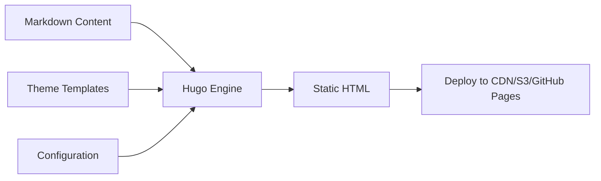

> **Hugo** 是用 Go 语言编写的开源静态网站生成器，以**极致的构建速度**和**灵活的模板系统**闻名。  
> 它不依赖数据库和运行时环境，将 Markdown 内容编译为纯静态 HTML，天然适合文档站、博客和企业官网。

---

## 📊 数据一览



*数据来源：Hugo 官方及 GitHub 社区统计 / Source: Hugo official & GitHub community*

---

## 🧩 核心特性 / Core Features


⚡ | Build Speed | 单页构建耗时 <1ms。4000+ 页的文档站全量构建仅需 2-3 秒。Hugo builds a 4000-page docs site in under 3 seconds.
🎯 | Go Templates | 基于 Go 的模板引擎，支持 block、partial、shortcode 组合，无其他依赖。Powerful Go template engine with blocks, partials, and shortcodes.
🌐 | i18n / l10n | 原生国际化支持，可一键切换语言、自动 fallback，适合多语言站点。Built-in internationalization with language switching and automatic fallback.
📦 | Themes | 300+ 社区主题，gohugo.io/themes 一键安装，支持子模块管理。300+ community themes, install via git submodules.
📝 | Shortcodes | Markdown 内嵌 HTML 组件，可复用、可嵌套，扩展内容表现力。Embed reusable HTML components inside Markdown content.
🔍 | Taxonomies | 灵活的标签/分类体系，支持自定义分类法，自动生成聚合页面。Flexible tagging and categorization with automatic aggregation.
📱 | Responsive | 无默认样式，完全自定义。结合 Tailwind、Bootstrap 可构建任何 UI。Zero default styles, fully customizable with Tailwind or Bootstrap.
🔋 | Extensible | 通过 Hugo Modules、Custom Output Formats 扩展，支持 JSON、AMP 等多种输出。Extend via modules and custom output formats — JSON, AMP, and more.


---

## 🏗️ 架构 / Architecture

Hugo 的架构极其简单，核心只有 **三部分**：

```
📁 hugo-site/
├── 📄 content/       ← 你的内容 (Markdown)
├── 🎨 themes/        ← 主题模板
└── ⚙️ hugo.toml      ← 站点配置
```

### 构建流程



如果你偏好技术细节，编译过程分为 **四个阶段**：

1. **读取配置** — 解析 `hugo.toml`、多语言配置、输出格式
2. **解析内容** — 读取 `content/` 下的所有 Markdown，提取 Front Matter
3. **渲染页面** — 合并内容 + 模板，生成 HTML/JSON/XML
4. **写入磁盘** — 输出到 `public/` 目录，附带资源哈希指纹

> Hugo 没有 "runtime" 和 "database" 层。每一次 `hugo` 命令都是**一次完整的、可预测的编译**，不会有任何动态依赖。

---

## 🚀 性能对比 / Performance

| 框架 | 语言 | 10 页 | 1000 页 | 10000 页 |
|------|------|------|---------|----------|
| **Hugo** | Go | **0.02s** | **0.3s** | **2.1s** |
| Gatsby | JS/Node | 2.1s | 45s | 8m+ |
| Next.js SSG | JS/Node | 1.8s | 35s | 6m+ |
| Jekyll | Ruby | 0.8s | 12s | 3m+ |

> 数据来源：[StaticGen Benchmarks](https://www.staticgen.com/) · 测试环境：2 vCPU / 4GB RAM

---

## 🌍 多语言配置 / Multi-language

Hugo 的多语言是**一等公民**。你可以在同一个文件树上写出中英双语内容：

### 配置

```toml
baseURL = 'https://example.org/'

defaultContentLanguage = 'zh'
[languages]
  [languages.zh]
    title = 'guai2028'
    languageName = '中文'
    weight = 1
  [languages.en]
    title = 'guai2028'
    languageName = 'English'
    weight = 2
```

### 内容组织

```
content/
├── posts/
│   ├── hugo-intro.zh.md    ← 中文版
│   └── hugo-intro.en.md    ← English version
└── _index.md
```

Hugo 会自动生成语言切换链接、为每种语言独立输出 RSS，甚至连 `sitemap.xml` 都会按语言分离。

---

## 🎨 主题系统 / Theme System

PaperMod（本博客使用的主题）是一个现代、简约但功能丰富的 Hugo 主题：

### 内置功能

| 功能 | 说明 |
|------|------|
| 🌗 Dark / Light 模式 | 自动跟随系统 / 手动切换 |
| 🔍 客户端搜索 | 纯 JS 搜索，无需后端 |
| 🍞 面包屑导航 | 自动生成层级路径 |
| 📖 阅读时间估算 | 基于字数自动计算 |
| 📋 代码复制按钮 | 一键复制代码块 |
| 🏷️ 标签聚合 | 自动生成标签页 |
| 📱 全响应式 | 适配桌面到手机 |

---

## 💡 实用技巧 / Tips & Tricks

```go-html-template
{{/* 条件判断：仅在生产环境启用分析 */}}
{{ if not hugo.IsDevelopment }}
  <script src="/analytics.js"></script>
{{ end }}

{{/* 资源图片处理：自动裁剪 + WebP */}}
{{ $image := resources.Get "photo.jpg" }}
{{ $thumb := $image.Fill "400x300 webp" }}

```

### 你还可以用 Hugo 做：

- ✅ 用 `resources.ExecuteAsTemplate` 在构建时生成 JSON 数据文件
- ✅ 用 `--minify` 配合 `postcss` 实现 CSS 压缩
- ✅ 用 `--printI18nWarnings` 检测未翻译的字符串
- ✅ 用 Hugo Modules 替代 git submodule 管理主题依赖

---

## 📖 学习资源 / Resources

| 资源 | 链接 |
|------|------|
| 📄 官方文档 | [gohugo.io/documentation](https://gohugo.io/documentation/) |
| 🎨 主题市场 | [themes.gohugo.io](https://themes.gohugo.io/) |
| 🧪 在线试玩 | [gohugo.io/getting-started/quick-start/](https://gohugo.io/getting-started/quick-start/) |
| 💬 社区论坛 | [discourse.gohugo.io](https://discourse.gohugo.io/) |
| ⭐ GitHub | [github.com/gohugoio/hugo](https://github.com/gohugoio/hugo) |

---

## 🎬 结语

> Hugo 的核心哲学是 **速度** 与 **简单**。  
> 如果你需要一个**不依赖运行时、构建毫秒级、部署零成本**的网站，Hugo 几乎是完美选择。

本博客就是使用 Hugo + PaperMod 构建，通过 GitHub Actions 自动部署到 Pages，全程无需手动干预。
